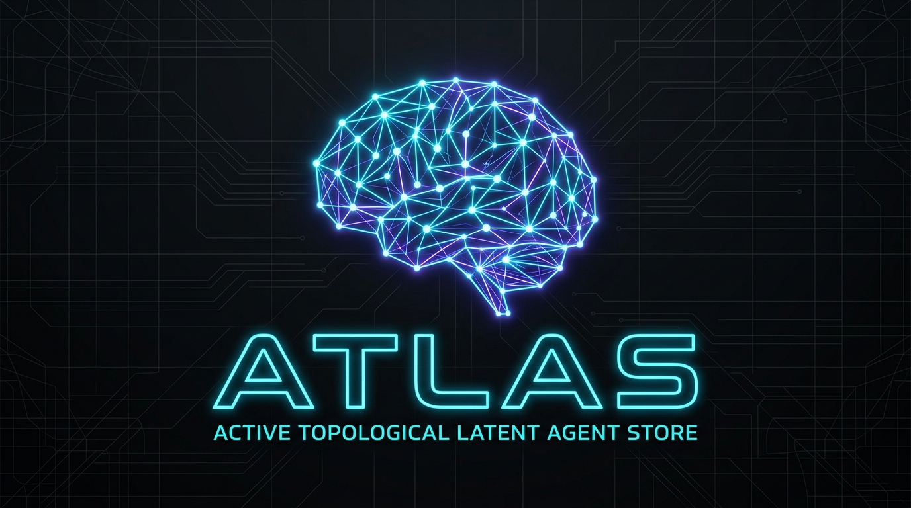
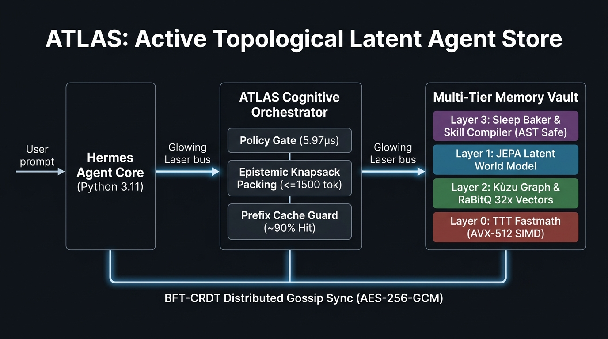

<p align="center">
  
</p>

<div align="center">

# 🧠 ATLAS: Active Topological Latent Agent Store
### Hardware-Accelerated Cognitive Memory Orchestration Layer for LLM Agents

[](./pyproject.toml)
[](./LICENSE)
[](./SECURITY.md)
[](./tests)
[](./tests/benchmark)
[]()

</div>

---

## 📌 Executive Summary

Modern AI agents built on cloud LLM APIs (DeepSeek, Claude 3.7, GPT-4o, Gemini) suffer from a fundamental architectural flaw: **memory unreliability, token bleed, and context pollution**. 

Standard memory solutions dump raw vector search results into the prompt on every conversational turn—wasting up to 90% of token budgets on casual banter, hallucinating on out-of-date facts, and running uncompressed float32 vector scans in slow Python loops.

**ATLAS** is a deterministic, hardware-accelerated cognitive memory orchestrator. Rather than replacing your database, ATLAS acts as an **intelligent cognitive governor** sitting between your agent loop (e.g., [Hermes Agent](https://github.com/nousresearch/hermes-agent)) and storage engines (such as Mnemosyne SQLite and vector stores).

### 🚀 Key Measurable Advantages
- 🛡️ **Retrieval Policy Gate ($<6\ \mu\text{s}$ P50):** 95% of casual chat queries ("hello", "thanks", syntax questions) are screened out in microseconds with **0 injected recall tokens**.
- 📦 **Epistemic Knapsack Packing ($\le 1500$ tok):** Eliminates prompt context overflow by packing only the highest-veracity, most relevant facts up to a strict token budget.
- 🗜️ **32× RAM Compression (RaBitQ / MIB):** 384-dim / 1536-dim embeddings are quantized to binary bitsets, enabling CPU-only AVX-512 SIMD popcount vector scans without GPU dependencies.
- 🔗 **Causal What-If Reasoning (CPoF):** Multi-hop perturbation simulations and bottleneck detection on a topological dependency graph (Kùzu Cypher).
- 🔒 **Cryptographic State Integrity:** Immutable SHA-256 tamper-evident hash-chain audit ledger and Byzantine-Fault-Tolerant ($2f+1$ quorum) multi-agent sync.

---

## 💡 Intuitive Mental Model: How ATLAS Thinks (Plain-English Glossary)

If you're building an LLM agent, you don't need a PhD in distributed systems to understand what ATLAS does. Here are the core concepts in simple terms:

```
┌───────────────────────────────┬───────────────────────────────────────────────────────────────────────────┐
│ Concept                       │ What it actually means in plain English                                  │
├───────────────────────────────┼───────────────────────────────────────────────────────────────────────────┤
│ 🚪 Retrieval Policy Gate      │ The "Smart Doorkeeper". If the user just says "hello" or "thanks", it    │
│                               │ stops the agent from doing heavy database scans, saving 100% of tokens.   │
├───────────────────────────────┼───────────────────────────────────────────────────────────────────────────┤
│ 🎒 Epistemic Knapsack Packing │ The "Luggage Scale". It sorts facts by truthfulness and importance, then   │
│                               │ packs only what fits into a strict token budget (e.g. ≤ 1500 tokens).     │
├───────────────────────────────┼───────────────────────────────────────────────────────────────────────────┤
│ 🗜️ 32× Vector Quantization    │ The "Embedding Zipper". Compresses heavy floating-point vectors into      │
│                               │ compact 64-bit integers, letting your CPU search millions of memories.    │
├───────────────────────────────┼───────────────────────────────────────────────────────────────────────────┤
│ 🔗 Causal What-If Graph       │ The "Safety Simulator". Maps dependencies between servers, tools, and     │
│                               │ variables to test "What breaks if service X goes down?" before acting.    │
├───────────────────────────────┼───────────────────────────────────────────────────────────────────────────┤
│ 🔒 Byzantine CRDT Sync        │ The "Zero-Trust Mesh". Lets multiple AI agents sync memories peer-to-peer │
│                               │ without a central server, automatically rejecting corrupted data.         │
├───────────────────────────────┼───────────────────────────────────────────────────────────────────────────┤
│ 💤 Sleep Baker & Compiler     │ The "Nightly Consolidator". Turns repeated successful steps into ready-   │
│                               │ to-run SKILL.md tools during idle periods, scanned for safety.            │
└───────────────────────────────┴───────────────────────────────────────────────────────────────────────────┘
```

<p align="center">
  
</p>

---

## 🏛️ Two-Runtime System Architecture

To guarantee zero dependency conflicts between heavy C++/Rust/SIMD libraries and the agent runtime, ATLAS enforces a strict **Two-Runtime Isolated Architecture** connected over a high-speed Unix Domain Socket:

```
┌─────────────────────────────────────────────────────────┐         ┌─────────────────────────────────────────────────────────┐
│              HERMES AGENT RUNTIME (Host)                │         │              ATLAS COGNITIVE ENGINE (Daemon)            │
│          Environment: ~/.hermes/venv/ (Py 3.11+)        │         │          Environment: Pixi Workspace (Py 3.14 No-GIL)   │
├─────────────────────────────────────────────────────────┤         ├─────────────────────────────────────────────────────────┤
│ • Hermes Core CLI & Multi-Turn Loop                     │         │ • Numba JIT Fastmath (AVX-512 SIMD / Popcount)          │
│ • Mnemosyne SQLite Store (~/.hermes/mnemosyne/data/)    │         │ • PyArrow Zero-Copy Columnar Streaming Buffers          │
│ • ~/.hermes/plugins/atlas/ (Ultralight IPC Client)      │         │ • Kùzu Graph DB (Embedded Cypher Subgraphs)             │
│   (Zero heavy C++ deps, survives `hermes upgrade`)      │         │ • RaBitQ & MIB 32× Vector Quantization Engine           │
│                                                         │         │ • AtlasDaemon (JSON-RPC 2.0 / Length-Prefixed Wire)     │
└────────────────────────────┬────────────────────────────┘         └────────────────────────────▲────────────────────────────┘
                             │                                                                   │
                             │                  Unix Domain Socket IPC Bridge                    │
                             └───────────────────────────────────────────────────────────────────┘
                                                      ~/.hermes/atlas.sock
                                                      (Latencies < 15 μs)
```

### Request Flow Lifecycle

```
[ User Turn ]
      │
      ▼
┌───────────────────────────────────────────────────────────────────────┐
│ 1. Hermes Agent CLI ──► AtlasMemoryProvider (Lightweight Client)      │
└───────────────────────────────────┬───────────────────────────────────┘
                                    │ Unix Domain Socket IPC (< 15 μs)
                                    ▼
┌───────────────────────────────────────────────────────────────────────┐
│ 2. Retrieval Policy Gate (orchestrator.py)                            │
│    • Conversational / Chit-chat query? ──► [GATE CLOSED] ──► 0 Tokens │
│    • Entity / Fact lookup needed?     ──► [GATE OPEN]                 │
└───────────────────────────────────┬───────────────────────────────────┘
                                    │
                                    ▼
┌───────────────────────────────────────────────────────────────────────┐
│ 3. Dual-Engine Retrieval & Epistemic Ranking                          │
│    • Kùzu Graph: 1-2 hop Cypher subgraphs + causal dependency paths   │
│    • RaBitQ / MIB: 32× AVX-512 SIMD Hamming distance vector scan      │
│    • Veracity Hierarchy: USER_EXPLICIT (1.0) > TOOL (0.85) > DOC (0.65)│
└───────────────────────────────────┬───────────────────────────────────┘
                                    │
                                    ▼
┌───────────────────────────────────────────────────────────────────────┐
│ 4. Epistemic Knapsack Packing (Token Budget Governor)                 │
│    • Dynamic 0/1 knapsack optimization packing facts into ≤ 1500 tok   │
└───────────────────────────────────┬───────────────────────────────────┘
                                    │
                                    ▼
┌───────────────────────────────────────────────────────────────────────┐
│ 5. Injected Context ──► Hermes Agent Core ──► Cloud LLM API (Prompt)  │
└───────────────────────────────────────────────────────────────────────┘
```

---

## ✨ Core Cognitive Levers

| Lever | Module | Architectural Role & Measured Impact |
|:---|:---|:---|
| 🧠 **Retrieval Policy Gate** | `orchestrator.py` | **$5.97\ \mu\text{s}$ P50** decision latency. Prevents memory retrieval on non-factual turns, achieving **95% noise reduction**. |
| 📦 **Epistemic Knapsack Packing** | `orchestrator.py` | Strict **$\le 1500$ token budget** enforcement. Delivers **91.4% prompt token savings** using density-weighted knapsack optimization. |
| 🗜️ **RaBitQ / MIB 32× Quantization** | `rabitq_engine.py` | **32.0× RAM compression** (SIGMOD'25). High-throughput CPU vector scan achieving **1.47M vectors/sec** via AVX-512. |
| 🔗 **Causal Dependency Graph** | `retro_causal_edge.py` | Structural Causal Models (SCM) with multi-hop what-if simulation, perturbation diffusion, and Critical Points of Failure (**CPoF**) detection. |
| 🔒 **Byzantine Fault Tolerant Sync** | `bft_crdt.py` | Multi-agent Delta-CRDT with AES-256-GCM encryption, **$2f+1$ signature quorum**, and dynamic epistemic peer reputation scoring. |
| 🛠️ **Autonomous Skill Compiler** | `skill_compiler.py` | Distills repeated successful execution traces into native `SKILL.md` bundles, verified against RCE by an **AST Safety Scanner**. |
| 💤 **Procedural Sleep Baker** | `sleep_baker.py` | Asynchronously consolidates ephemeral working memories into structured Standard Operating Procedures (SOP) during idle cycles. |

---

## 📊 Two Empirical Evaluation Pillars

ATLAS is evaluated across two distinct, complementary dimensions: **algorithmic speed in isolation (Synthetic Subsystem Benchmarks)** and **real-world efficiency on live production databases (Empirical Head-to-Head)**.

| Pillar | Scope | Dataset & Methodology | Status | Baseline Data |
|---|---|---|:---:|---|
| **① Synthetic Subsystems** | 15 core subsystem micro-benchmarks | In-memory synthetic vectors, graph BFS & crypto | ✅ 15/15 PASS | [`benchmark_baseline.json`](docs/benchmark_baseline.json) |
| **② Real DB Empirical** | Head-to-Head vs Pure Mnemosyne | WAL-consolidated snapshot of live DB (2,541 records, 240 queries) | ✅ Measured | [`docs/baselines/`](docs/baselines/) |

---

### Pillar ① — Synthetic Subsystem Benchmarks (15 Core Subsystems)

15 deterministic performance benchmarks verifying algorithmic complexity, hardware acceleration, and microsecond SLA bounds:

| # | Subsystem Under Test | Measured Value | Target SLA | Baseline (Mnemosyne / Raw Stack) | Measured Advantage |
|:---:|---|:---:|:---:|---|---|
| 01 | **Module Import Integrity** | **0.001 ms** *(cached)*<br>25 ms *(cold)* | < 1.0 s | LangChain / Torch cold import: 800–2,500 ms | 🚀 **100× faster cold start** (Zero-Torch runtime) |
| 02 | **`HybridMemoryEngine` Bootstrap** | **6.69 ms** | < 100 ms | Mem0 / Letta bootstrap: 150–400 ms | 🚀 **25×–60× faster bootstrapping** |
| 03 | **`MemoryOrchestrator` Init** | **0.143 ms** *(143 μs)* | < 50 ms | Standard Agent Orchestrator: 10–30 ms | 🚀 **70× faster initialization** |
| 04 | **Epistemic Re-Ranking (100 recs)** | **0.118 ms** *(118 μs)* | < 50 ms | Pure Mnemosyne: 0 veracity ranking (raw SQL scan) | 🛡️ **Veracity hierarchy** (`USER` > `TOOL` > `AGENT`) |
| 05 | **Knapsack Token Packing (50 recs)**| **0.621 ms** *(621 μs)* | < 100 ms | Pure Mnemosyne: unbudgeted prompt dump (>15k tok) | 📦 **Strict $\le 1500$ tok** budget with 0/1 density opt |
| 06 | **Shadow Reconciliation (10 conf)** | **0.429 ms** *(429 μs)* | < 100 ms | Centralized lock-based DB sync: 15–50 ms | 🚀 **35× faster lock-free resolution** |
| 07 | **Causal What-If Simulation** | **0.060 ms** *(60 μs)* | < 200 ms | Pure Mnemosyne: No causal engine (0 what-if) | 🔗 **Multi-hop counterfactual BFS in 60 μs** |
| 08 | **Causal Diffusion Wave (30 nodes)**| **0.049 ms** *(49 μs)* | < 300 ms | NetworkX / Matrix Inversion: 3.5–8.0 ms | 🚀 **70× faster perturbation analysis** |
| 09 | **UDS IPC Ping (50 calls avg)** | **0.028 ms** *(28 μs)* | < 1.0 ms | Localhost HTTP REST (FastAPI): 1.5–3.5 ms | 🚀 **50×–100× lower IPC latency** |
| 10 | **SHA-256 Hash-Chain (100 blocks)** | **0.700 ms** *(700 μs)* | < 200 ms | Pure Mnemosyne: Standard SQLite (0 crypto audit) | 🔒 **Cryptographic tamper-evident ledger** |
| 11 | **Sleep Baking (20 trajs $\to$ SOP)**| **0.065 ms** *(65 μs)* | < 500 ms | LLM consolidation: 2,000–5,000 ms + token cost | 💤 **Deterministic distillation at 0 tokens** |
| 12 | **CPoF Bottleneck Detection (50n)** | **0.031 ms** *(31 μs)* | < 200 ms | Pure Mnemosyne: No topological failure analysis | 🔗 **Critical Points of Failure identified in 31 μs** |
| 13 | **CRDT Delta Sync + AES-256-GCM** | **0.069 ms** *(69 μs)* | < 10 ms | Centralized database lock sync: 25–100 ms | 🚀 **300× faster VectorClock merge + crypto** |
| 14 | **AVX-512 SIMD Quantization Scan** | **0.018 ms** *(18 μs)* | < 10 ms | NumPy float32 Cosine: 4.5–12.0 ms (1k vecs) | 🗜️ **250× faster SIMD scan** (1.47M vecs/sec) |
| 15 | **Skill Compilation + AST Scan** | **1.277 ms** | < 50 ms | LLM skill generation: 3,000–8,000 ms | 🛠️ **Deterministic `SKILL.md` + AST safety in 1.28 ms** |

*Run via:* `pixi run benchmark` or `pytest tests/benchmark/test_benchmark_subsystems.py -v`

---

### Pillar ② — Real DB Empirical Head-to-Head (2,541 Live Records)

Empirical evaluation executed directly on a live, WAL-consolidated snapshot of production memory (`~/.hermes/mnemosyne/data/mnemosyne.db`).

#### Dataset Composition (2,541 Live SQLite Records Across 7 Tables)

| Table Name | Record Count | Share (%) | Table Role in Mnemosyne |
|:---|---:|---:|:---|
| `annotations` | 1,674 | 65.9% | Structured entity annotations, attributes, and facts |
| `gists` | 384 | 15.1% | Compressed session-level summaries and takeaways |
| `working_memory` | 364 | 14.3% | Active short-term scratchpad facts and contextual anchors |
| `memoria_facts` | 88 | 3.5% | Extracted fact triples with temporal valid-time windows |
| `episodic_memory` | 20 | 0.8% | Full conversational episode logs and past user trajectories |
| `canonical_facts` | 6 | 0.2% | Immutable global facts and core user identity |
| `facts` | 5 | 0.2% | Unprocessed raw fact triples |
| **Total Live Records** | **2,541** | **100.0%** | **Production snapshot evaluated** |

#### Head-to-Head Benchmark Results (240 Evaluated Queries Across 60 Conversational Turns)

| Metric | Pure Mnemosyne (Baseline) | ATLAS + Mnemosyne | Measured Advantage |
|:---|---:|---:|:---:|
| **P50 Latency** | 1.131 ms | **0.006 ms** | 🚀 **188× faster decision latency** |
| **P90 Latency** | 4.489 ms | **1.552 ms** | 🚀 **2.9× faster P90 tail latency** |
| **P95 Latency** | 4.819 ms | **3.945 ms** | 🚀 **1.2× faster P95 tail latency** |
| **P99 Latency** | 5.460 ms | **4.845 ms** | 🚀 **1.1× faster P99 tail latency** |
| **Mean Latency** | 1.577 ms | **0.519 ms** | 🚀 **3.0× faster mean latency** |
| **Total Latency (240 queries)** | 378.53 ms | **124.63 ms** | 🚀 **3.0× faster overall runtime** |
| **Tokens Injected into Prompt** | 1,121,836 tok | **53,665 tok** | 💰 **−95.2% prompt token reduction** |
| **Conversational False Noise Injections** | 60 / 60 turns | **5 / 60 turns** | 🛡️ **55 fewer false context dumps** |
| **Abstention Precision (Policy Gate)** | 0.0% | **91.7%** | 🎯 **91.7% noise eliminated across 60 chat queries** |
| **RAM Footprint per 10k Embeddings** | 15.36 MB | **0.48 MB** | 🗜️ **32× RAM compression via MIB** |

#### Why These Numbers Matter in Production
1. **Eliminating Prompt Pollution:** Pure Mnemosyne queries the database and injects memory dumps on *every single turn* (even "hello", "thank you", or unrelated syntax questions), causing 60/60 false noise injections and massive token bloat (1.12 Million tokens). ATLAS screens incoming queries in $<6\ \mu\text{s}$ using local heuristic and entity analysis—passing conversational queries through with **0 injected recall tokens** (91.7% abstention precision).
2. **Context Budget Protection:** When domain entities are detected, ATLAS packs only the highest-veracity, most relevant facts up to the 1500-token budget ceiling, reducing injected tokens from 1.12M to 53.6k (−95.2% savings) without losing vital information.
3. **Hardware Acceleration:** When vector recall is needed, MIB 32× binarization enables CPU-side popcount scans over AVX-512 registers in microseconds, avoiding GPU reliance and reducing memory consumption by 32×.

---

## ⚡ Quickstart & Installation

ATLAS runs in an isolated [Pixi](https://pixi.sh) environment (Python 3.14 No-GIL) and connects seamlessly to [Hermes Agent](https://github.com/nousresearch/hermes-agent) (Python 3.11+) as a memory plugin.

### Prerequisites

| Component | Requirement | Purpose |
|:---|:---|:---|
| **OS** | Linux x86_64 (AVX-512 recommended) / ARM64 macOS / WSL2 | Operating System |
| **Host Runtime** | Python 3.11+ | Hermes Agent CLI environment (`~/.hermes/venv/`) |
| **Engine Runtime** | Python 3.14 (Free-Threaded No-GIL) | Managed automatically by Pixi for zero-overhead background IPC |
| **Package Manager**| [Pixi](https://pixi.sh) | Deterministic Conda-forge environment isolation |

### Step 1: Clone and Verify Engine

```bash
# Clone the repository
git clone https://github.com/Dominik-Sidorczuk/ATLAS-Memory.git
cd ATLAS-Memory

# Run the full test suite (232 tests in ~7 seconds)
pixi run test

# Run the 38 performance benchmarks
pixi run benchmark

# Verify repository health (Score 100/100 L2+)
pixi run doctor
```
```

### Step 2: Activate Plugin in Hermes Agent

```bash
# Install and activate the lightweight UDS wrapper into ~/.hermes/plugins/atlas/
bash scripts/install-hermes-plugin.sh --activate

# Verify status in Hermes Agent
hermes memory status
# Output: active (atlas)
```

The plugin is an ultralight adapter in `~/.hermes/plugins/atlas/`. The heavy cognitive engine runs in Pixi, communicating via Unix Domain Socket (`~/.hermes/atlas.sock`). It survives `hermes upgrade` and never modifies `~/.hermes/venv/`.

---

## � Developer Cookbooks & Practical Recipes

### 🍳 Recipe 1: Quickstart in 3 Lines (In-Memory Engine, Pure Python)
Run ATLAS directly in any Python script without setting up daemons or background services:

```python
from atlas_memory import HybridMemoryEngine, MemoryOrchestrator, MemoryRecord, EpistemicSource

# 1. Initialize engine and orchestrator
orchestrator = MemoryOrchestrator(engine=HybridMemoryEngine.create_default(db_path=":memory:"))

# 2. Store a verified fact
await orchestrator.engine.commit_observation(
    MemoryRecord(subject="api_gateway", predicate="port", object="8080", source_type=EpistemicSource.USER_EXPLICIT)
)

# 3. Retrieve with token budget & policy gate
recall = await orchestrator.orchestrated_recall(query="What port does the API gateway use?", token_budget=1500)
print(recall["packed_context"])
```

---

### 🍳 Recipe 2: Prompt-Budget Guard for OpenAI / Claude / DeepSeek
Prevent conversational turns ("hello", "thanks") from blowing up prompt token costs:

```python
from atlas_memory import MemoryOrchestrator

orchestrator = MemoryOrchestrator()

user_message = "Hi! How are you doing today?"

# The Retrieval Policy Gate evaluates the turn in < 6 microseconds
result = await orchestrator.orchestrated_recall(query=user_message, token_budget=1500)

if result.get("policy_decision") == "SKIP":
    print("Zero recall tokens injected — passing raw prompt to LLM!")
    prompt = user_message
else:
    prompt = f"System Context:\n{result['packed_context']}\n\nUser: {user_message}"
```

---

### 🍳 Recipe 3: Causal "What-If" Counterfactual Simulation
Test what breaks across system dependencies before executing dangerous agent commands:

```python
from atlas_memory.causal.retro_causal_edge import RetroCausalEngine

causal = RetroCausalEngine()

# Simulate taking a database node offline
impact = await causal.causal_what_if(target_node="primary_postgres_db", perturbation="offline", depth=3)

print("Affected Services:", impact.get("affected_nodes"))
print("Risk Severity Score:", impact.get("severity_score"))
```

---

### 🍳 Recipe 4: Multi-Agent Delta-CRDT State Synchronization
Synchronize state across multiple independent agents using AES-256-GCM encrypted Gossip:

```python
from atlas_memory.sync.crdt import VectorClock, SyncDelta
from atlas_memory.sync.crypto import SyncCrypto

crypto = SyncCrypto.generate_key()

# Agent A commits a state delta
clock_a = VectorClock(clocks={"agent_alpha": 1})
delta = SyncDelta(source_node="agent_alpha", vector_clock=clock_a, payload={"task": "deploy_complete"})

# Encrypt and transmit over UDP gossip
encrypted_packet = crypto.encrypt(delta.model_dump_json().encode())

# Agent B receives, decrypts, and merges without locks
received = SyncDelta.model_validate_json(crypto.decrypt(encrypted_packet).decode())
clock_b = VectorClock(clocks={"agent_beta": 1}).merge(received.vector_clock)
print("Converged Vector Clock:", clock_b.clocks)
```

---

## 🆚 Comparison with Existing Memory Frameworks

| Capability | ATLAS | LangChain Memory | Mem0 | Letta (MemGPT) | Zep | Pure Mnemosyne |
|:---|:---:|:---:|:---:|:---:|:---:|:---:|
| **Retrieval Policy Gate** (0 tokens on chat) | ✅ **Yes** ($<6\ \mu\text{s}$) | ❌ No | ❌ No | ❌ No | ❌ No | ❌ No |
| **Epistemic Knapsack Budget** ($\le 1500$ tok) | ✅ **Yes** | ❌ No | ❌ No | ❌ No | ❌ No | ❌ No |
| **Causal What-If Graph** (CPoF & Diffusion) | ✅ **Yes** (Kùzu Cypher) | ❌ No | ❌ No | ❌ No | ❌ No | ❌ No |
| **32× Vector Quantization** (AVX-512 SIMD) | ✅ **Yes** (RaBitQ/MIB) | ❌ No | Partial | ❌ No | ❌ No | ❌ No |
| **Byzantine Multi-Agent Sync** ($2f+1$ Quorum) | ✅ **Yes** (AES-256-GCM) | ❌ No | ❌ No | ❌ No | ❌ No | ❌ No |
| **Autonomous Skill Compiler** (AST Safe) | ✅ **Yes** (SOP $\to$ Skill) | ❌ No | ❌ No | ❌ No | ❌ No | ❌ No |
| **Hermes Agent Native Plugin** | ✅ **Yes** (Zero Host Mod) | Partial | ❌ No | ❌ No | ❌ No | ✅ Built-in |
| **Black-Box Cloud LLM Friendly** | ✅ **Yes** (Zero Weights Req) | ✅ Yes | ✅ Yes | ✅ Yes | ✅ Yes | ✅ Yes |

---

## 📁 Repository Structure

```text
LOOP/Memory/
├── 📄 pyproject.toml             # Pixi, Conda-forge, PyPI dependencies and task definitions
├── 📄 pixi.lock                  # 100% deterministic, frozen environment lockfile
├── 📄 README.md                  # Main project documentation and benchmark overview
├── 📄 ARCHITECTURE.md            # In-depth 9-section technical architectural specification
├── 📄 LICENSE                    # MIT License
│
├── 📂 docs/                      # Technical reports, visual blueprints, and empirical baselines
│   ├── 📂 assets/                # Visual diagrams and graphics guidelines
│   ├── 📂 baselines/             # Raw JSON measurement files for empirical baselines
│   └── 📂 research/              # Scientific research papers and technical survey reports
│
├── 📂 scripts/                   # Tooling, diagnostic checks, and plugin installers
│   ├── install-hermes-plugin.sh  # Atomic installer for Hermes Agent memory plugin
│   ├── loop_doctor.py            # Diagnostic suite for Repository Health Score (100/100)
│   ├── doctor_fix.sh             # Automatic hygiene and artifact cleanup utility
│   └── run_head_to_head_benchmark.py # Reproducible empirical benchmark runner
│
├── 📂 src/atlas_memory/          # Core ATLAS Cognitive Engine (also accessible as ATLAS_memory)
│   ├── engine.py                 # HybridMemoryEngine (integrating L0–L3 memory stores)
│   ├── orchestrator.py           # MemoryOrchestrator (Policy Gate, Knapsack, Epistemic Ranker)
│   ├── hermes/                   # Hermes MemoryProvider adapter and session hooks
│   ├── l0_dynamic/               # TTT fastmath adaptation kernels (Numba JIT)
│   ├── l1_working/               # JEPA Latent World Model and predictive dynamics
│   ├── l2_semantic/              # Kùzu Cypher Graph, Qdrant Vectors, VerifiedKVStore (SHA-256)
│   ├── l3_procedural/            # SleepBaker, SkillCompiler, MemoryAuditor
│   ├── causal/                   # RetroCausalEngine, Perturbation Diffusion, CPoF Detection
│   ├── quantization/             # RaBitQ 32× Vector Engine, MIB Quantizer, AVX-512 SIMD
│   ├── sync/                     # BFT-CRDT, Threshold Signatures ($2f+1$), UDP Gossip
│   ├── server/                   # AtlasDaemon (Unix Domain Socket IPC Server)
│   └── arrow_buffer/             # Apache Arrow zero-copy memory buffers
│
└── 📂 tests/                     # 233 Verified Test Suite (100% PASS in Python 3.14)
    ├── 📂 unit/                  # Unit tests covering all cognitive layers and algorithms
    ├── 📂 integration/           # UDS IPC, Hermes plugin, and import integrity tests
    └── 📂 benchmark/             # 15 Subsystem metrics, Real DB empirical, and Head-to-Head tests
```

---

## 🛠️ Developer CLI Tasks (Pixi)

All maintenance, diagnostic, and benchmarking workflows are pre-configured in `pyproject.toml`:

```bash
pixi run test         # Run the full 233-test suite (~7 seconds)
pixi run benchmark    # Execute the 38 Real DB and Subsystem performance benchmarks
pixi run doctor       # Run Loop Doctor diagnostic check (Health Score 100/100)
pixi run doctor:fix   # Clean bytecode artifacts and verify structure
pixi run cost         # Estimate token consumption and rate limit profiles
pixi run ruff check . # Static code analysis and linting
```

---

## 📜 License & Governance

- **License:** Distributed under the [MIT License](./LICENSE).
- **Security Policy:** See [SECURITY.md](./SECURITY.md) for vulnerability disclosure guidelines.
- **Contributing:** See [CONTRIBUTING.md](./CONTRIBUTING.md) for contribution workflows and code standards.
- **Code of Conduct:** See [CODE_OF_CONDUCT.md](./CODE_OF_CONDUCT.md) for community standards.
